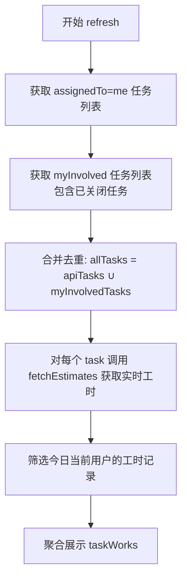

# 修复方案：任务关闭后刷新，已完成工时变0

## 根因分析

当任务在禅道网页上被"完成"或"关闭"后，该任务不再出现在 `assignedTo=me` 的 API 返回列表中。当前 [`AppState.refresh()`](Sources/ZentaoBar/AppState.swift:177) 的流程是：

```
获取任务列表 (assignedTo=me) → 对每个任务获取工时 → 聚合展示
```

任务关闭后，第一步就获取不到该任务，因此不会去拉取它的工时数据，导致展示为0。

**已确认**：已关闭任务的 [`GET /api.php/v1/tasks/{id}/estimate`](Sources/ZentaoBar/Services/ZentaoAPIClient.swift:230) 接口仍然能正常返回工时数据。

## 方案 E：使用 myInvolved 接口补充已关闭任务

### 核心思路

禅道提供了一个 `my-contribute-task-myInvolved` 接口，可以获取**当前用户参与过的所有任务**（包括已关闭的）。在现有流程中增加一个步骤：从该接口获取已关闭的任务，与 `assignedTo=me` 的任务合并，再统一获取工时。

### 数据流



### 关键发现

接口 `GET /my-contribute-task-myInvolved--id_desc.json` 返回的数据结构：

```
{
  "status": "success",
  "data": {
    "tasks": {
      "26038": { "id": 26038, "name": "...", "status": "closed", "assignedTo": "closed", ... },
      "25932": { "id": 25932, "name": "...", "status": "closed", "assignedTo": "closed", ... },
      ...
    },
    "pager": {
      "recTotal": 633,     // 总共633个任务
      "recPerPage": 20,
      "pageTotal": 32
    }
  }
}
```

- `data.tasks` 是一个字典，key 是任务ID（字符串），value 是任务对象
- 每个任务包含 `id`、`name`、`status`、`assignedTo` 等字段
- `status: "closed"` 表示已关闭，`status: "doing"` 表示进行中
- 支持分页：`recPerPage=20`，可通过修改 URL 中的数字调整每页数量

### 文件变更

#### 1. 修改 [`ZentaoAPIClient.swift`](Sources/ZentaoBar/Services/ZentaoAPIClient.swift)

**新增方法** `fetchMyInvolvedTasks()`：

```swift
/// 获取当前用户参与过的所有任务（包括已关闭的）
/// 使用禅道旧版 my/contribute 页面接口
func fetchMyInvolvedTasks(baseURL: String, token: String) async throws -> [ZentaoTask] {
    // 尝试获取多页，每页100个，最多获取500个
    let pageSize = 100
    let maxPages = 5  // 最多获取500个任务
    
    var allTasks: [Int: ZentaoTask] = [:]
    
    for page in 1...maxPages {
        let path = "/my-contribute-task-myInvolved-\(page)-\(pageSize)-id_desc.json"
        let data = try await request(baseURL: baseURL, path: path, token: token)
        
        // 解析 JSON
        guard let root = try JSONSerialization.jsonObject(with: data) as? [String: Any],
              let status = root["status"] as? String, status == "success",
              let dataStr = root["data"] as? String,
              let dataObj = dataStr.data(using: .utf8),
              let parsed = try JSONSerialization.jsonObject(with: dataObj) as? [String: Any],
              let tasksDict = parsed["tasks"] as? [String: [String: Any]] else {
            break
        }
        
        for (_, taskDict) in tasksDict {
            if let id = taskDict["id"] as? Int,
               let name = taskDict["name"] as? String {
                allTasks[id] = ZentaoTask(
                    id: id,
                    name: name,
                    assignedTo: taskDict["assignedTo"] as? String,
                    execution: taskDict["execution"] as? Int
                )
            }
        }
        
        // 检查是否还有更多页
        if let pager = parsed["pager"] as? [String: Any],
           let recTotal = pager["recTotal"] as? Int,
           page * pageSize >= recTotal {
            break  // 已获取全部
        }
    }
    
    return Array(allTasks.values)
}
```

#### 2. 修改 [`AppState.swift`](Sources/ZentaoBar/AppState.swift) 的 `refresh()` 方法

修改点（约第214-235行）：

```swift
// 修改前：
let tasks = try await fetchTasksForCurrentUser(...)
var aggregates: [Int: TaskWork] = Dictionary(
    uniqueKeysWithValues: tasks.map { task in ... }
)

// 修改后：
let tasks = try await fetchTasksForCurrentUser(...)

// 额外获取"我参与过的"任务列表（包含已关闭的）
let involvedTasks = try? await apiClient.fetchMyInvolvedTasks(
    baseURL: config.baseURL,
    token: token
)

// 合并两个列表，去重
let allTasks: [ZentaoTask]
if let involvedTasks {
    let taskMap = Dictionary(uniqueKeysWithValues: tasks.map { ($0.id, $0) })
    let merged = taskMap.merging(
        Dictionary(uniqueKeysWithValues: involvedTasks.map { ($0.id, $0) })
    ) { current, _ in current }  // 优先保留 assignedTo=me 的任务
    allTasks = Array(merged.values)
} else {
    allTasks = tasks
}

var aggregates: [Int: TaskWork] = Dictionary(
    uniqueKeysWithValues: allTasks.map { task in
        (task.id, TaskWork(
            id: task.id,
            name: task.name,
            url: "\(baseURL)/task-view-\(task.id).html",
            totalConsumed: 0
        ))
    }
)
```

#### 3. 修改 [`ZentaoTask`](Sources/ZentaoBar/Models.swift)（可选）

如果 `myInvolved` 接口返回的 `execution` 字段名可能不同，可以保持当前结构不变，因为 `ZentaoTask` 已经用 `Decodable` 且字段可选。

### 边界情况处理

| 场景 | 行为 |
|------|------|
| 任务关闭后刷新 | myInvolved 接口包含该任务 → 正常获取工时 → 正常显示 |
| 新建→填报→关闭（1分钟内） | myInvolved 接口包含该任务 → 正常获取工时 → 正常显示 ✅ |
| myInvolved 接口返回 403/失败 | 降级处理，只使用 assignedTo=me 的任务（行为与当前一致） |
| 任务数量超过500个 | 只获取前5页（500个），通常足够覆盖近期任务 |
| 跨日 | 工时数据通过 `estimate.date == today` 筛选，跨日后自然归零 |

### 性能考量

- myInvolved 接口只返回"我参与过的"任务，不会拉取全量数据
- 分页获取，每页100个，最多5页（500个任务）
- 该接口是禅道旧版页面接口，响应速度通常较快
- 如果接口失败，降级为当前行为，不影响正常使用

### 实现步骤

1. 修改 [`Sources/ZentaoBar/Services/ZentaoAPIClient.swift`](Sources/ZentaoBar/Services/ZentaoAPIClient.swift)：
   - 新增 `fetchMyInvolvedTasks()` 方法
2. 修改 [`Sources/ZentaoBar/AppState.swift`](Sources/ZentaoBar/AppState.swift)：
   - 在 `refresh()` 方法中，获取 `assignedTo=me` 任务后，再获取 `myInvolved` 任务
   - 合并两个列表，去重后统一获取工时
